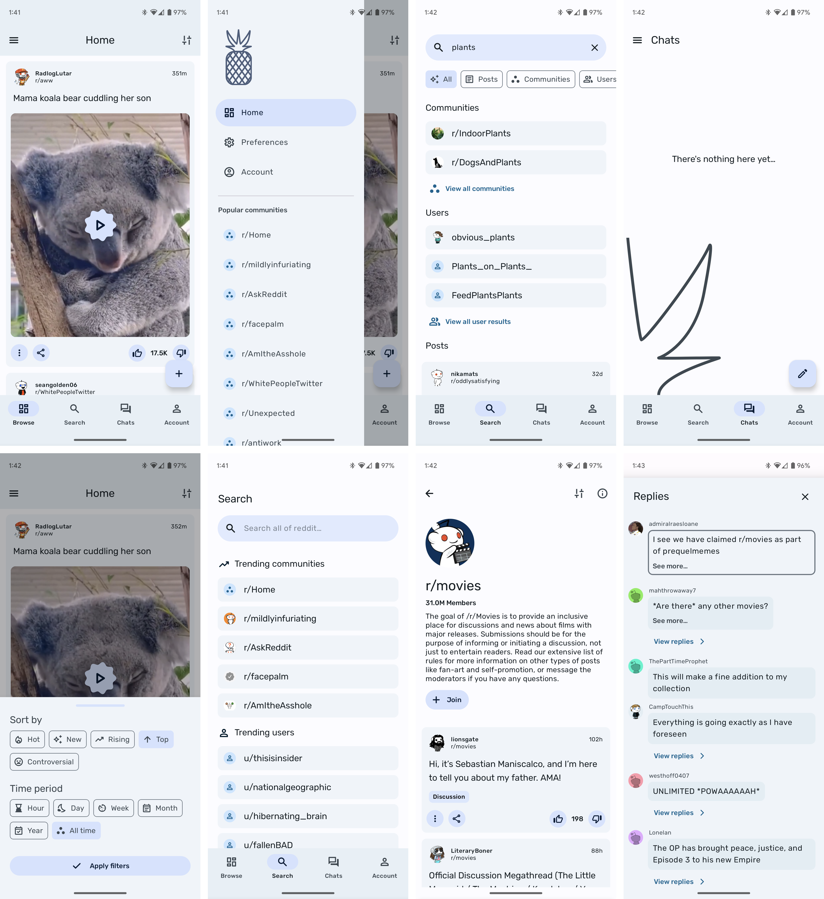

# Pineapple
Reddit client for Android highlighting Material Design 3 aspects, with dynamic color and a clean, more minimalistic design. (WIP)



# Build notes
Before building, you must do the following steps so that OAuth and basic network functionality will work:
1. Sign-in, and create a new client on https://www.reddit.com/prefs/apps
2. Make sure the redirect URI is set to "pineapple://login"
3. Copy the client secret, and paste in the ```gradle.properties``` file:
```
...

ClientSecret="PASTE CLIENT SECRET HERE"

...
```
4. Build in Android Studio or using gradle on the command line
