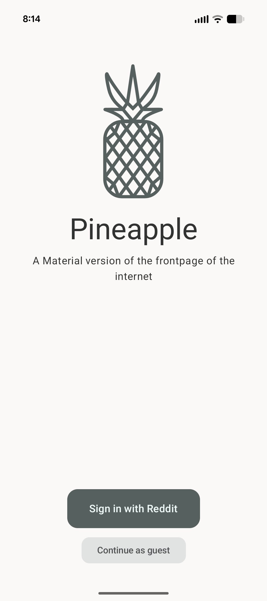
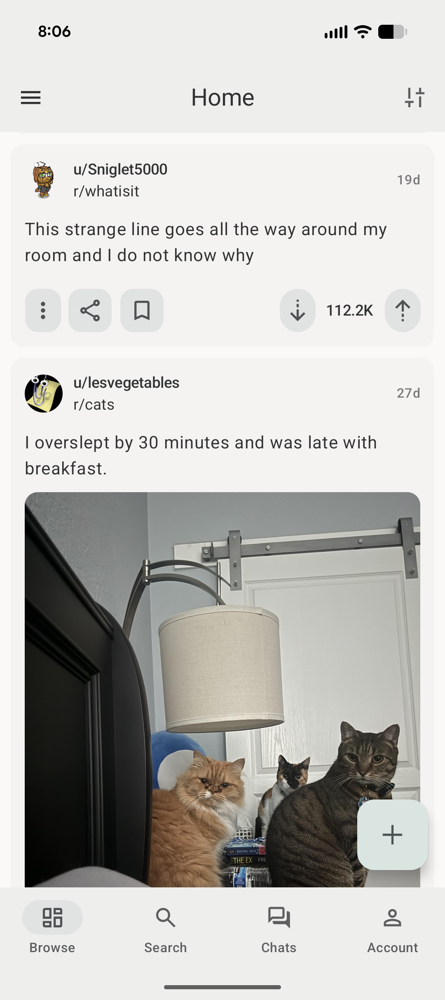
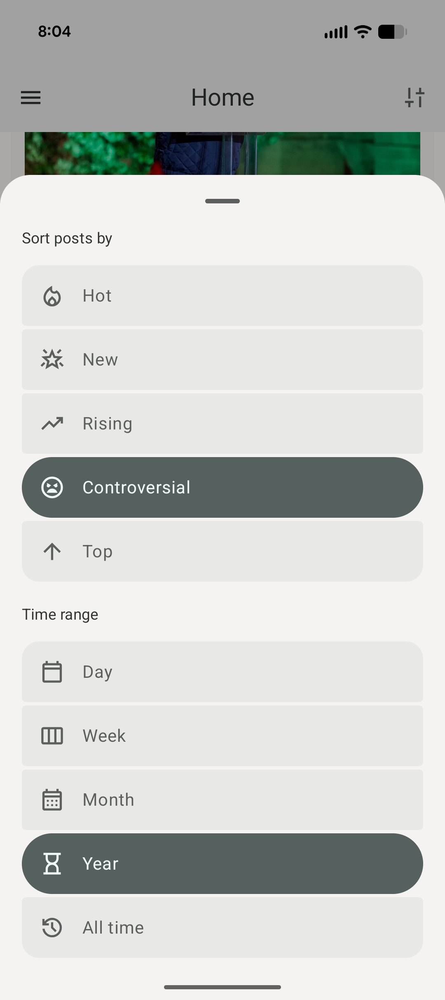

# Pineapple 🍍

Pineapple is an Android reddit client application developed with Jetpack Compose following the Material 3 Expresive design guidelines with Dynamic Color and a clean architecture approach. The application is designed to be free to use, with each user supplying their own created Reddit key that remains on-device to avoid the new API pricing restrictions. 

  
  
  
  
  

